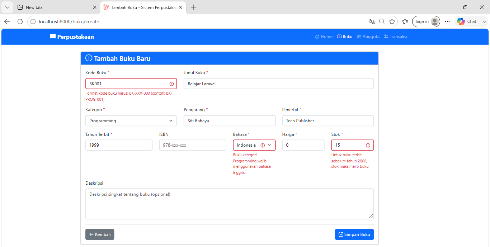
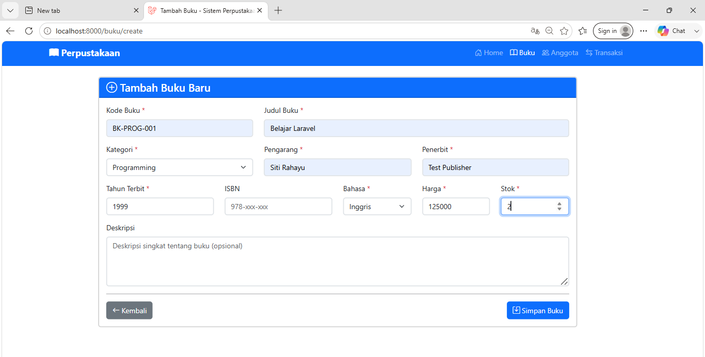
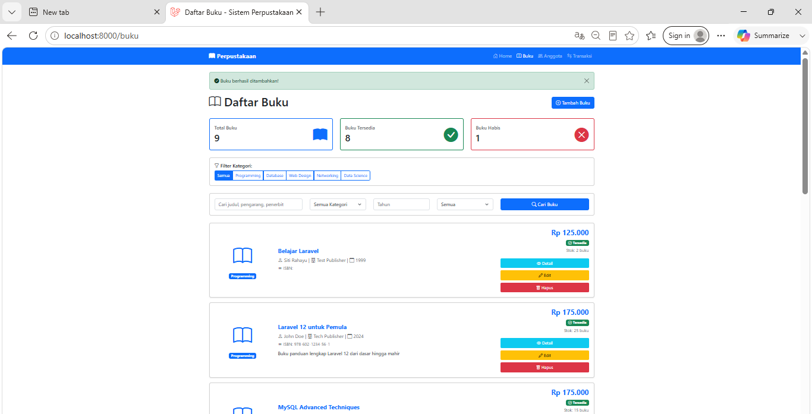
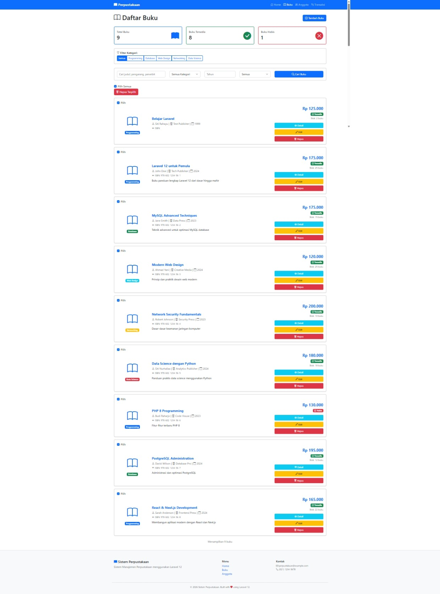
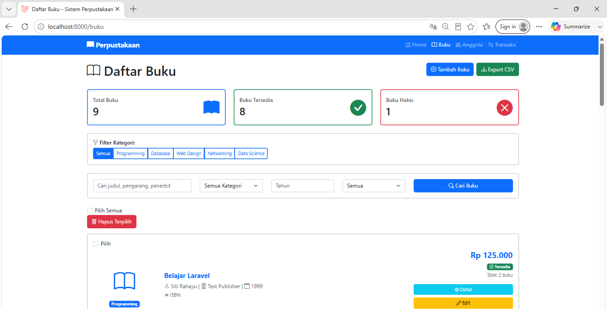

# Tugas Pertemuan 12 - CRUD Buku Dengan Laravel

**Nama:** Ramona Aprilia Yuniar  
**NIM:** 60324039  
**Prodi:** Informatika  
**Semester:** 4  
**Repository:** https://github.com/ramonaapriliayuniar55/Pertemuan-12-CRUD-Buku-dengan-Laravel.git

---

# Tugas 1 : Form Request Validation & Custom Validation Rule

## Perintah yang Digunakan

```bash

php artisan make:rule KodeBukuFormat
```

---

## Komponen yang Dibuat

### StoreBukuRequest

Digunakan untuk memvalidasi data saat menambahkan buku baru.

Validasi yang diterapkan:

* Kode buku wajib diisi
* Kode buku harus unik
* Kategori harus valid
* Harga tidak boleh negatif
* Stok tidak boleh negatif
* Tahun terbit harus valid

### UpdateBukuRequest

Digunakan untuk memvalidasi data saat mengedit buku.

### Custom Rule KodeBukuFormat

Format kode buku:

```text
BK-XXX-000
```

Contoh:

```text
BK-PROG-001
BK-WEB-002
BK-NET-003
```

---

## Hasil Validasi

### Input Tidak Valid



### Input Valid



###  Hasil Input Valid



---

# Tugas 2 : Bulk Delete Buku


## Fitur yang Ditambahkan

* Checkbox pada setiap buku
* Checkbox Pilih Semua
* Tombol Hapus Terpilih
* Hapus banyak data sekaligus

---

## Tampilan Bulk Delete

Fitur ini memungkinkan pengguna memilih banyak buku kemudian menghapusnya dalam satu klik.

### Screenshot



---

# Tugas 3 : Export Data Buku ke CSV

## Tujuan

---

## Fitur Export

* Export seluruh data buku
* Download otomatis file CSV
* Dapat dibuka menggunakan Microsoft Excel

---

## Data yang Diexport

* Kode Buku
* Judul
* Kategori
* Pengarang
* Penerbit
* Tahun Terbit
* ISBN
* Harga
* Stok

---

## Screenshot Export CSV


